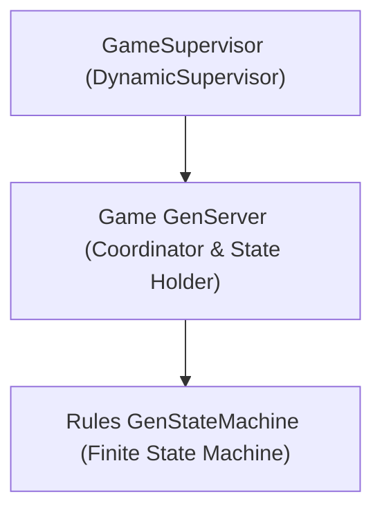
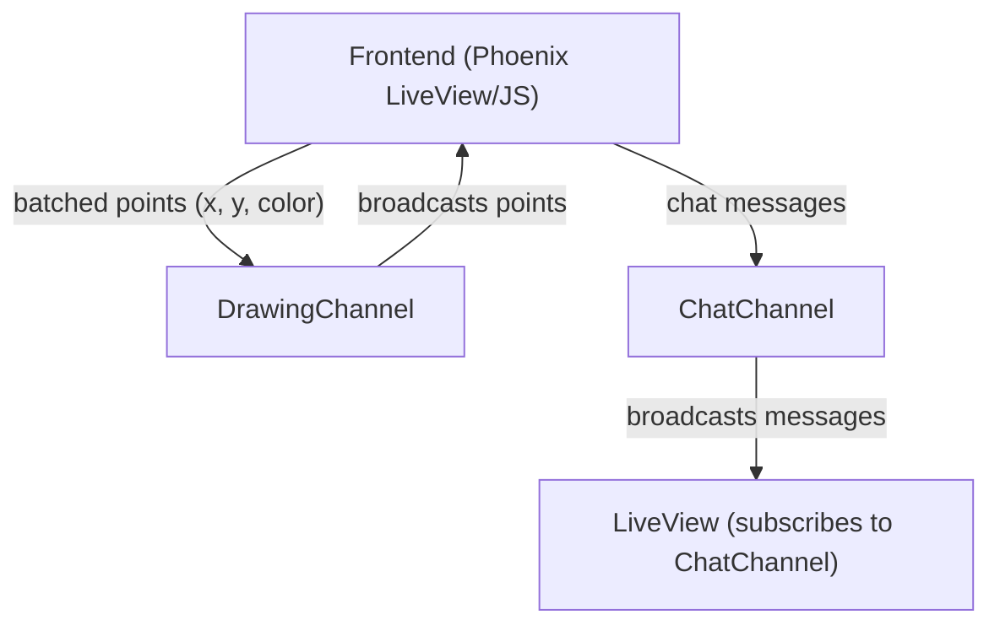
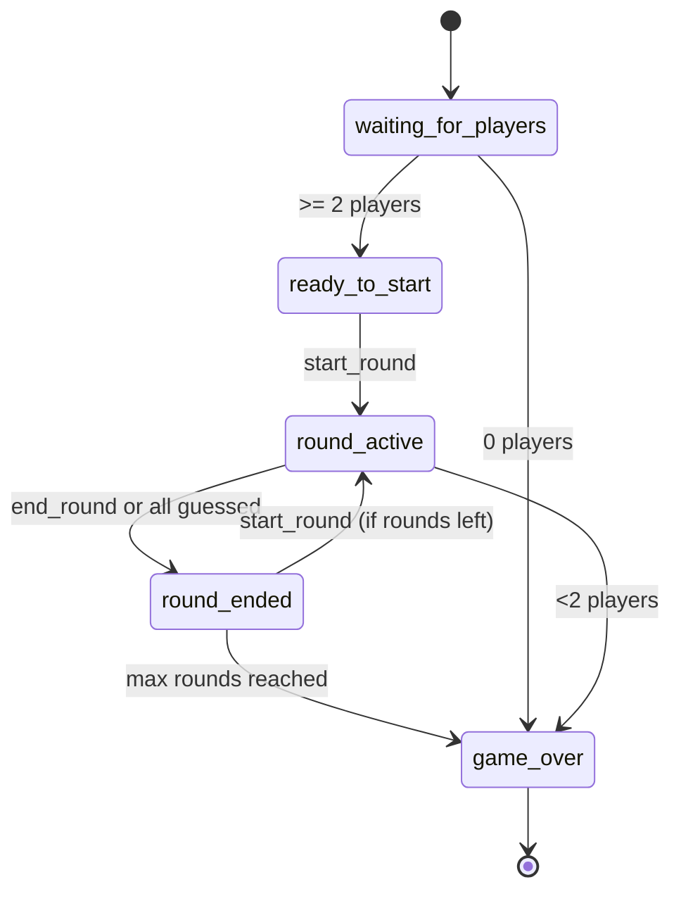

# Egaite

Draw with friends!  
[https://egaite.app](https://egaite.app)

## Overview

Egaite is a multiplayer drawing game built with Elixir and Phoenix. Players take turns drawing and guessing words, earning points for correct guesses.

## Features

- Real-time multiplayer drawing and guessing
- Multiple rounds and players per game
- Points and score tracking
- Play against bots
- Modern Phoenix 1.7+ stack
- Storybook for UI component development


## Architecture Diagrams
These diagrams illustrate the core structure and process flow of Egaite. They show how game processes are supervised, how channels handle real-time communication, and how the finite state machine manages game state transitions.

### Game Process Supervision



### Channel Communication



### Game State Flow



## Getting Started

### Prerequisites

- Elixir & Erlang (see `.tool-versions` or `mix.exs` for versions)
- Node.js (for assets)
- Docker & Docker Compose (for deployment)
- PostgreSQL database

### Setup (Development)

1. **Install dependencies:**
    ```sh
    mix deps.get
    cd assets && npm install
    ```

2. **Setup the database:**
    ```sh
    mix ecto.create
    mix ecto.migrate
    ```

3. **Start the Phoenix server:**
    ```sh
    mix phx.server
    ```
    Visit [http://localhost:4000](http://localhost:4000) in your browser.

### Storybook

Egaite uses [Phoenix Storybook](https://storybook.elixir.dev/) for developing and testing UI components.

To start Storybook locally:

```sh
mix storybook.server
```

Then visit [http://localhost:6006](http://localhost:6006).

### Running Tests

```sh
mix test
```

### Deployment

This project uses GitHub Actions for CI/CD and Docker Compose for deployment.

- On push to `main`, tests are run and, if successful, the app is built and deployed using Docker Compose.
- Database migrations and seeds are run automatically during deployment.

See [`.github/workflows/deploy.yml`](.github/workflows/deploy.yml) for details.

## Configuration

Environment variables used in production (see GitHub Actions secrets):

- `DATABASE_URL`
- `POOL_SIZE`
- `SECRET_KEY_BASE`
- `PHX_HOST`
- `PORT`
- `DNS_CLUSTER_QUERY`
- `DB_NAME`
- `DB_USER`
- `DB_PASSWORD`

## Learn More

- [Phoenix Framework](https://www.phoenixframework.org/)
- [Elixir Lang](https://elixir-lang.org/)
- [Phoenix Storybook](https://storybook.elixir.dev/)

---

Ready to draw? Start the server and invite your friends!